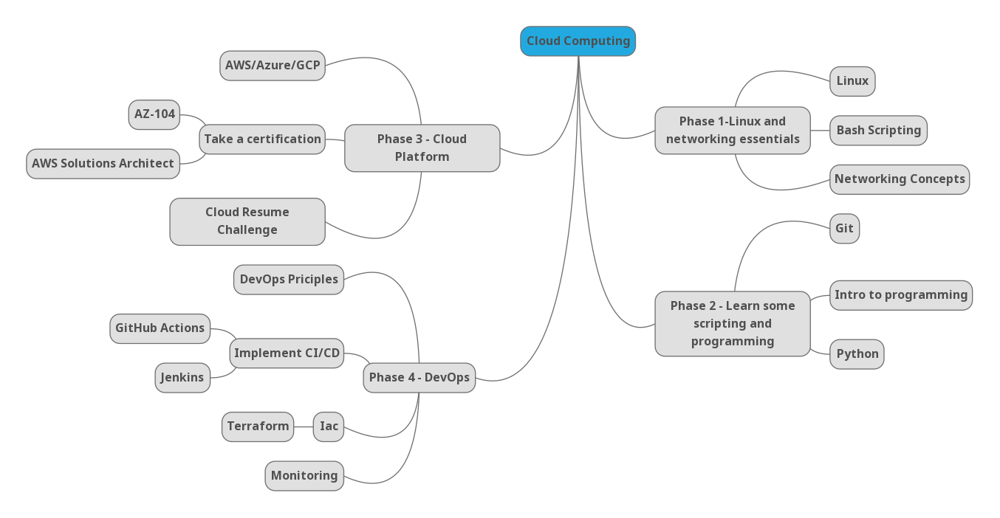

# Learn the fundamentals of Cloud Computing in 6 months

A self-taught learning guide to cloud computing.

## Phases

**[Web version here](https://madebygps.github.io/self-taught-guide-to-cloud-computing/)**

**[Watch the guide here](https://youtu.be/ts9vNsrJypE)**

| Order | Topic                           | Time commitment |
|-------|---------------------------------|-------------------|
| [1](phase1/README.md)     | Linux and Networking essentials | 6 weeks           |
| [2](phase2/README.md)     | Learn some scripting and code | 6 weeks           |
| [3](phase3/README.md)    | Learn a Cloud platform| 8 weeks           |
| [4](phase4/README.md)     | Learn some DevOps practices         | 4 weeks           |
| [At anytime](resources/readme.md)     | Study resources         | Up to you        |
| [At anytime](more-topics/README.md)     | Additional resources on tech related topics        | Up to you        |

## Note

This is a guide based on our experiences of going from help desk to Cloud and DevOps engineers. We tried to keep it as general and using the most popular options (in terms of content, community, and jobs) as possible.

The 6 month timeline is something we put in place to help people with planning and accountability. It may take you more or less time for each phase and if it does, that is completely fine.

Most of the resources we've listed have projects in each module/chapter. Don't leave them to the end and do them as you go.

### [Go to Phase 1: Linux and Networking](phase1/README.md)
