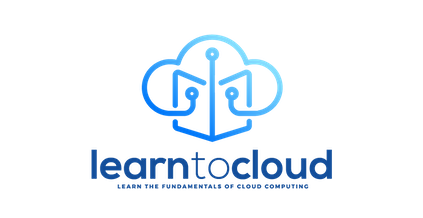

# Intro

**[Web version here](https://learntocloud.guide)**

This is a guide based on our experiences getting into Cloud and DevOps. Once done, you should have the technical knowledge for roles like:

- System administrator.
- Cloud Support Engineer.
- Cloud Administrator.

You can learn more about our journeys into cloud here:
- [Rishab's journey from help desk to DevOps engineer without a degree](https://youtu.be/LZuWZ0SBYm8) 
- [Gwyn's journey from help desk to Cloud engineer without a degree](https://youtu.be/kluKaLXJ2lg)

We tried to keep it as general and using the most popular options (in terms of content, community, and jobs) as possible.

The 6 month timeline is something we put in place to help people with planning and accountability. It may take you more or less time for each phase and if it does, that is completely fine.

## Phases

| Order | Topic                           | Time commitment |
|-------|---------------------------------|-------------------|
| [0](phase0/README.md)     | Start from zero tech experience  | optional 
| [1](phase1/README.md)     | Linux and Networking fundamentals | 4 weeks           |
| [2](phase2/README.md)     | Programming fundamentals | 4 weeks           |
| [3](phase3/README.md)    | Cloud Platform fundamentals| 8 weeks           |
| [4](phase4/README.md)     | DevOps fundamentals         | 8 weeks           |
| [At anytime](resources/readme.md)     | Study resources         | Up to you        |

### [Go to Phase 1: Linux and Networking fundamentals](phase1/README.md)
