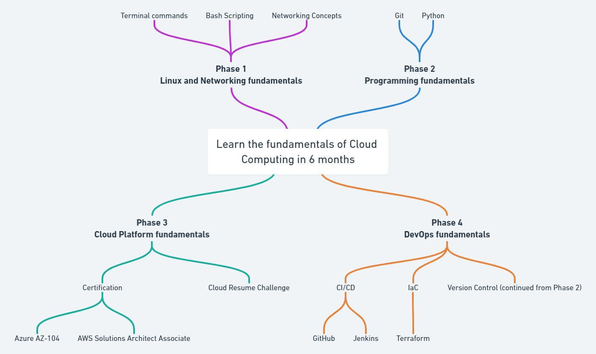

# Intro

This is a guide based on our experiences of going from help desk to Cloud and DevOps engineers. 

You can learn more about our journeys into cloud here:
- [Rishab's journey from help desk to DevOps engineer without a degree](https://youtu.be/LZuWZ0SBYm8) 
- [Gwyn's journey from help desk to Cloud engineer without a degree](https://youtu.be/kluKaLXJ2lg)

We tried to keep it as general and using the most popular options (in terms of content, community, and jobs) as possible.

The 6 month timeline is something we put in place to help people with planning and accountability. It may take you more or less time for each phase and if it does, that is completely fine.

Most of the resources we've listed have projects in each module/chapter. Don't leave them to the end and do them as you go.

**[Web version here](https://learntocloud.guide)**

## Phases

| Order | Topic                           | Time commitment |
|-------|---------------------------------|-------------------|
| [1](phase1/README.md)     | Linux and Networking fundamentals | 6 weeks           |
| [2](phase2/README.md)     | Programming fundamentals | 6 weeks           |
| [3](phase3/README.md)    | Cloud platform fundamentals| 8 weeks           |
| [4](phase4/README.md)     | DevOps fundamentals         | 4 weeks           |
| [At anytime](resources/readme.md)     | Study resources         | Up to you        |
| [At anytime](more-topics/README.md)     | Additional resources on tech related topics        | Up to you        |

[Web Version Mind Map](https://whimsical.com/cloud-computing-YXhM6K6UEmJ7iDe58MsUPx)

### [Go to Phase 1: Linux and Networking fundamentals](phase1/README.md)
