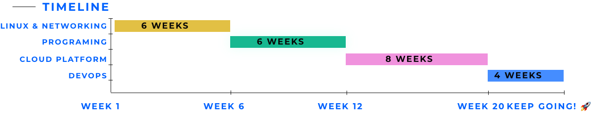

# Learn the fundamentals of Cloud Computing in 6 months

## [Watch the guide here](https://youtu.be/ts9vNsrJypE)

This is the learning path we would take if we had to start over again and work our way up to a junior cloud engineer skill set in about 6 months. Any links you see ARE NOT AFFILIATE LINKS, we don't want your money. Okay, let's go.

[Go to Phase 1: Linux and Networking](phase1/README.md)

## Note

This is a guide based on our experiences of going from help desk to Cloud and DevOps engineers. You journey is yours and you may need to learn different things at different stages.

We tried to keep it as general and using the most popular options (in terms of content, community, and jobs) as possible. Mainly because these things are important when you're getting started. As you grow, you'll need to get specialized in certain areas :)

## Awesome contributors

- [GPS](https://youtube.com/madebygps)
- [Rishab](https://www.youtube.com/channel/UCtLwBE6ZNXnQdQp5o36BUxA)
- [Lou](https://twitter.com/loujaybee)