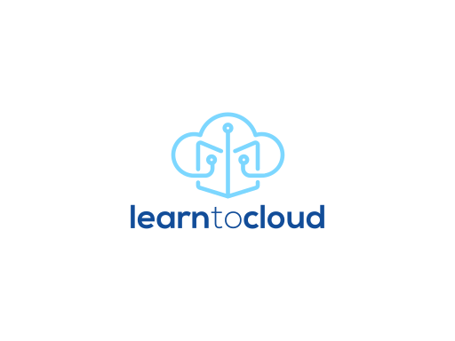

<!-- _coverpage.md -->

> A 6 month guide to the fundamentals of Cloud Computing

- Free and Open Source
- Resources, tasks, and projects
- Built from first hand experience

[GitHub](https://github.com/learntocloud/learn-to-cloud/)
[Get Started](#welcome)