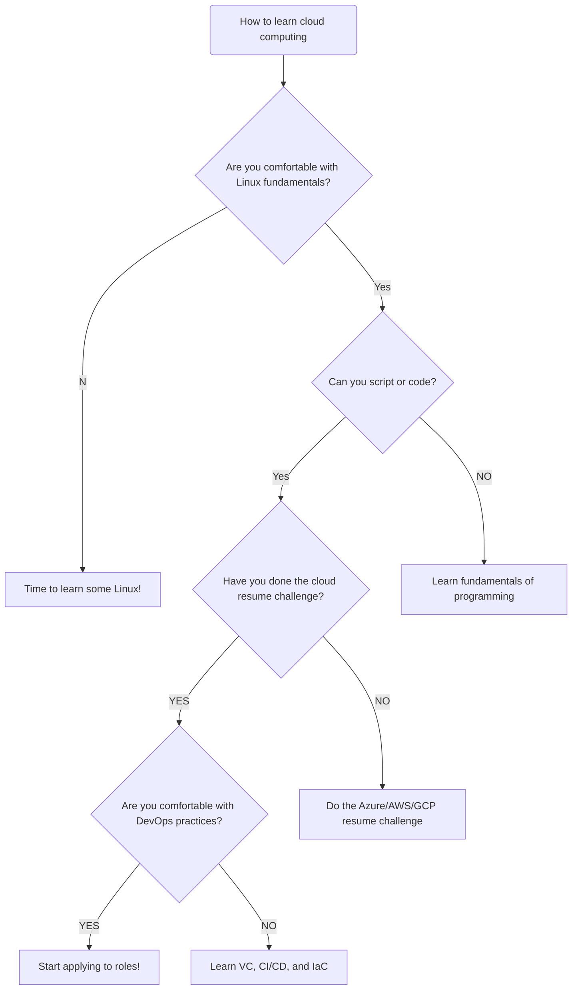

```mermaid
flowchart TD;
A(How to learn cloud computing)-->B{Are you comfortable with Linux fundamentals?};
B--Yes-->C{Can you script or code?};
B--No-->F[Time to learn some Linux!];
C--Yes-->D{Have you done the cloud resume challenge?};
C--NO-->E[Learn fundamentals of programming]
D--YES-->H{Are you comfortable with DevOps practices?};
D--NO-->G[Do the Azure/AWS/GCP resume challenge];
H--YES-->I[Start applying to roles!];
H--NO-->J[Learn VC, CI/CD, and IaC];
```